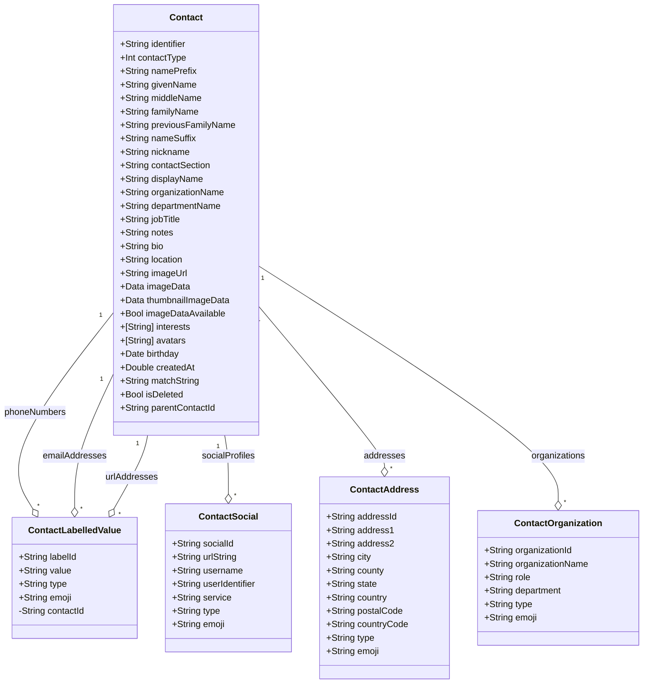

# Contacts Manager Data Architecture

This document outlines the data model architecture for the Contacts Manager application.

## Entity Relationship Diagram

## Architecture Overview

### Core Entity
- `Contact` serves as the central entity
- Contains all basic contact information
- Manages metadata and relationships

### Relationships
- All relationships use `@Relationship(deleteRule: .cascade)`
- When a Contact is deleted, all related records are automatically deleted
- One-to-many relationships between Contact and all other entities

### Value Types
1. **ContactLabelledValue**
   - Used for phone numbers, emails, and URLs
   - Contains value, type, and emoji
   - Unique ID based on contact, value, and type

2. **ContactAddress**
   - Stores postal address information
   - Includes multiple address components
   - Unique ID based on address components

3. **ContactSocial**
   - Manages social media profiles
   - Stores service-specific information
   - Unique ID based on social profile details

### Common Patterns
- All models conform to `Codable` for serialization
- Most models include `type` and `emoji` fields
- Each model has a display/formatting method
- Unique IDs are generated using SHA256 hashing
- All models follow consistent initialization patterns

### Data Integrity
- Cascading deletes ensure referential integrity
- Unique IDs prevent duplicate entries
- Proper relationship management maintains data consistency 